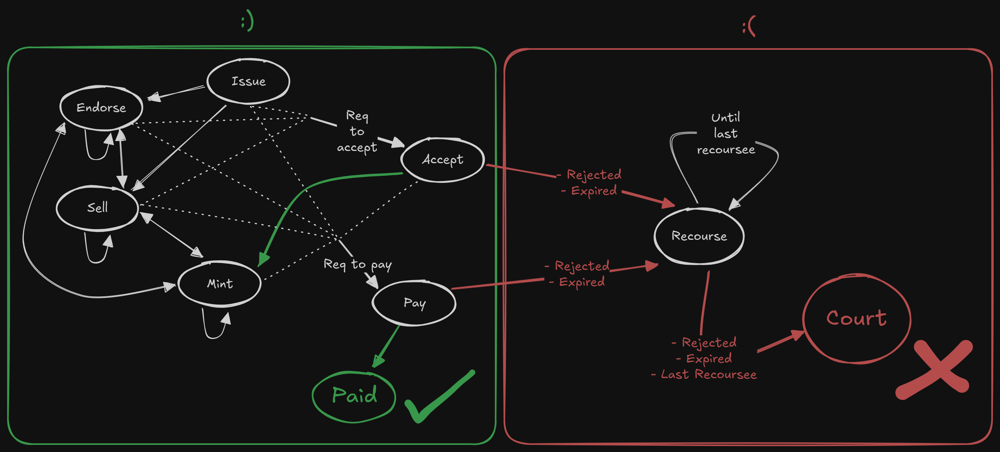

# Bill Actions

Here is an overview of the different actions that can be made on a bill and in which state they are valid.
and what these transitions depend on.

## Graph

[Link](https://excalidraw.com/#json=xQou2opICoFhMcap2WBUK,XPWsvfmpFGEg7yt7aYqVLQ)

## Bill Issuing

Bills can be issued by the drawer of the bill.

There are 3 types of bills

* PromissoryNote (0) - Drawer pays to payee
* SelfDrafted (1) - Drawee pays to drawer
* ThreeParties (2) - Drawee pays to payee

The drawee and payee can't be the same entity.

## Holder operations

The holder is either the initial payee of the bill, or the endorsee of the last endorsement
operation (Sell, Mint, Endorse, or Recourse).

### Endorsing Operations

#### Endorsing

The holder (endorser) endorses the bill to a given endorsee, which makes the endorsee
the new holder of the bill.

#### Selling

#### Offer To Sell

The holder (seller) can offer a bill for sale to a given buyer for a given price.
The offer is valid for 2 working days during which the bill is blocked until payment, rejection, or expiry.
If the deadline expires, the offer to sell is invalidated and the bill is unblocked.

##### Sell

If the buyer of an active offer to sell pays within two working days, the bill is
endorsed to the buyer.

#### Minting

The holder can offer to mint a bill with a given mint, getting a quote from it.
The holder can then accept the quote, which endorses the bill to the Mint.

### Requests

#### Request to Accept

The holder can request the drawee to accept the bill if it hasn't been requested to accept,
or accepted before.
It has to be accepted within 2 working days.
If this deadline expires, the bill can only be recoursed from that point on.

#### Request to Pay

The holder of the bill can request the bill to be paid, if it hasn't been paid,
or requested to be paid before.
The bill has to be paid within 2 working days, during which the bill is blocked until payment, rejection, or expiry.

If the request to pay was done before the bill maturity date, it is blocked for 2 working days, but after expiration
of the request, it just gets unblocked. The actual expiration is then 2 working days after the maturity date.

If the request to pay was done after the bill maturity date, the deadline starts at the end of the day where the
request to pay was made.

If this deadline expires, the bill can only be recoursed from that point on.

### Recourse

#### Request to Recourse for Accept

If a bill has been rejected to be accepted, or acceptance expired, it can be recoursed for acceptance against a recoursee.
The recoursee has to be a previous endorsee of the bill.
Within 2 working days, the recoursee has to pay the recourser the given amount, which blocks the bill until payment, rejection, or expiry.
If this deadline expires, the bill is permanently blocked and can only be resolved in court.

#### Request to Recourse for Payment

If a bill has been rejected to be paid, or payment expired, it can be recoursed for payment against a recoursee.
The recoursee has to be a previous endorsee of the bill.
Within 2 working days, the recoursee has to pay the recourser the given amount, which blocks the bill until payment, rejection, or expiry.
If this deadline expires, the bill is permanently blocked and can only be resolved in court.

#### Recourse

If a request for recourse has been paid, the bill is endorsed to the recoursee.
If the bill was recoursed to the last possible recoursee, it is blocked permanently and can only be resolved in cour.

## Drawee operations

The drawee is the "payer"-sider of the bill, as defined in the issuance of the bill.

### Acceptance

#### Accept Bill

The drawee can accept the bill.

#### Reject to Accept Bill

The drawee can reject to accept the bill.
Once this happens, only recourse actions can be made on the bill.

### Payment

#### Pay Bill

This "operation" does not result in a block, rather the payment happens in the background.
The system checks, if the payment happened and sets a flag on the bill, if it did.

Once the bill is paid, no further actions can be done with it.

#### Reject to Pay Bill

The drawee can reject to pay the bill, if there is an active request to pay, or 
if there was a request to pay before the maturity date that expired, but the bill payment
deadline has not expired (end of maturity date + 2 working days).
Once this happens, only recourse actions can be made on the bill.

## Buyer operations

### Reject to Buy

The buyer can reject to buy the bill, which unblocks the bill and invalidates the offer to sell.
A buyer can only reject to buy once per offer to sell and only if there is an active offer to sell.

## Recoursee (previous holder) operations

The recoursee is the target of a request to recourse. They are a previous endorsee of the bill.

### Reject Recourse

The recoursee can reject an active request to recourse.
If this happens, the bill is blocked permanently and can only be resolved in court.

