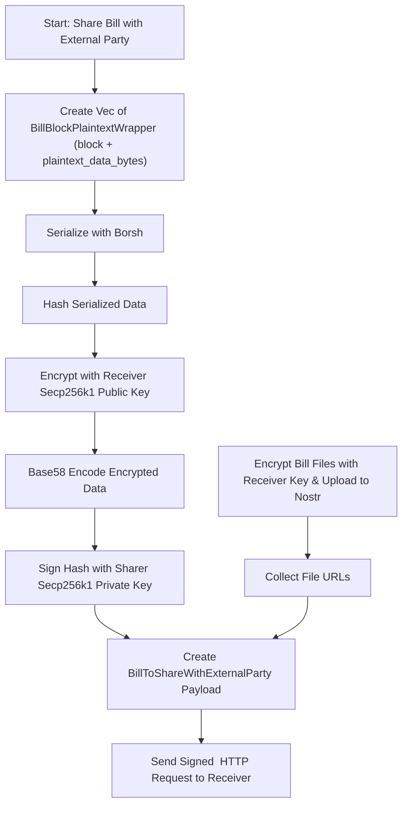
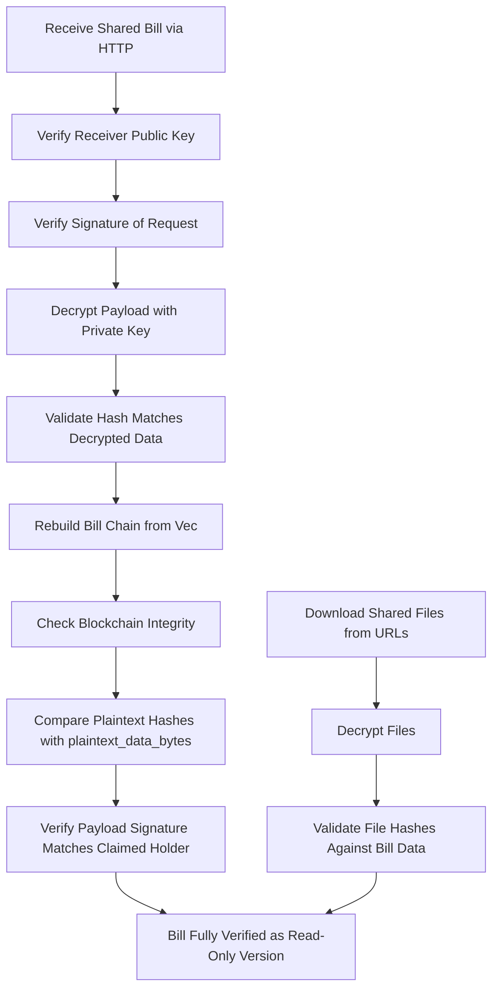
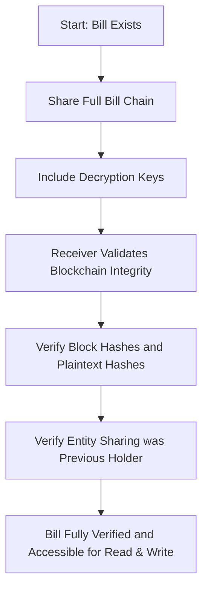

# Sharing Bills with external Parties

## Without Bill Keys

Bills can be shared with external parties. However, this mechanism has to work
in a way, where the bill keys are not shared, so the external party can read, but
not write to the bill.

Relevant use cases are:

* Minting - the bill has to be shared with a mint when it's requested to mint, so the Mint can make a decision
* Court - in a court case, the court needs read access to the bill, to be able to check the claims made

To achieve this, there is functionality in `bcr-ebill-core`, which does the following:

* Create a plaintext representation of a given bill chain and create a data structure that contains the block in its original state and the plaintext data next to it
    * `Vec<BillBlockPlaintextWrapper>`, where `BillBlockPlaintextWrapper` has `block: BillBlock` and `plaintext_data_bytes: Vec<u8>`
* Serialize the wrapper using `borsh` to a byte representation
* Calculate a hash over the serialized data, so it can be validated later
* Encrypt the serialized wrapper with the receiver (e.g. the Mint or the Court) public key (Secp256k1)
* Encode the encrypted data using base58
* Sign the above-created hash with the sharer private key (Secp256k1), so the receiver can make sure that this exact data was shared by that exact entity
* The bill files are also encrypted with the receiver public key, uploaded to Nostr and we send a list of the file URLs to the receiver
* The whole `BillToShareWithExternalParty` payload is then sent via an HTTP request, again, signed by the sharer, to the receiver

On the receiver side (e.g. the Mint):

* Verify that the receiver public key is correct
* Verify the signature of the request
* Decrypt the data and validate that the hash matches the unencrypted data
* Attempt to create a valid blockchain from the `Vec<Block>`, making sure all integrity checks of the encrypted bill chain hold
* Compare the `plaintext_hash` for each block with the corresponding `plaintext_data_bytes`, making sure the inner integrity holds and the encrypted and unencrypted data are the same
* Verify the signature of the payload and that it was signed by the holder as claimed by the bill data
* Download the shared files, decrypt them and validate them with the file hashes from the bill data

Then, e.g. if the Mint makes an offer, which gets accepted and the Mint receives the bill, the received bill can be 100% checked against the shared data by comparing block hashes and plaintext hashes to 
guarantee it's the same bill.

## With Bill Keys

The case where a bill is shared with bill keys is a lot simpler, since the receiver simply gets the whole bill chain with
encrypted data as well as the keys to decrypt it.
Using block hashes and integrity checks between the blocks, as well as the plaintext hashes within the blocks, the receiver can validate
that the shared bill is valid and that the entity sharing it had the right to share it (was the holder before).

