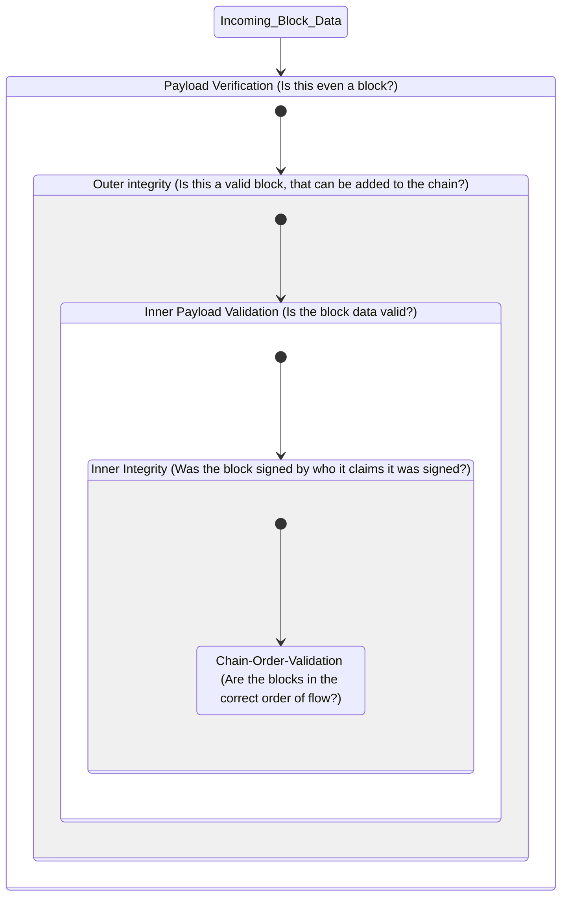

# Bill Validation

This graph describes our bill validation steps, from cheap, basic integrity checks on incoming data to
detailed coherency checks within the context of an active bill.

## Bill Actions Validation

This section describes which actions are possible by which bill participant depending on the state of the bill.

Data validation (e.g. valid NodeIds, valid dates and currencies) are not part of this section - it's just about whether an action is possible for a given participant of the bill.

### General Conditions & Terms

These are *very* important to understand the validation, since they concern all actions and are referenced in the validation conditions below.

E.g. for `RequestToPay`, the only condition is, that none of the following general conditions apply, which means, you can't `RequestToPay` if the bill was **requested to pay** before, although that's not explicitly spelled out.
The reason for this is, that `RequestToPay` can only be resolved by payment (**paid**), expiration or rejecting (**only recoursable**), which lead to one of the general conditions becoming true and hence would block another attempt to `RequestToPay`.

* **paid** - If the bill is paid - no further actions can be taken by any participant
* **recoursed to the end** - If the bill was recoursed to the end (i.e. the current holder does not have past endorsees to recourse against) - no further actions can be taken by any participant
* **only recoursable** - If the bill was rejected to pay, rejected to accept, payment expired, or acceptance expired - the only actions that can be taken from this point are `RequestRecourse`, `Recourse`, `RejectToPayRecourse`
* **blocked** - If the bill is in a waiting state - the only actions that can be taken are actions that resolve the waiting state
    * waiting states are:
        * Waiting for *payment* (triggered by `RequestToPay`), resolved by paying the bill, or `RejectToPay`, or deadline expiration
        * Waiting for a *sale* (triggered by `OfferToSell`), resolved by `Sell`, or `RejectToBuy`, or deadline expiration
        * Waiting for *recourse* (triggered by `RequestRecourse`), resolved by `Recourse`, or `RejectToPayRecourse`, or deadline expiration

### Issue

(Not that relevant here, since this is the first action to take.)

The action can only be executed by the bill issuer.

#### Conditions

* The issuer can't be anonymous
* The payer can't be anonymous
* The payer can't be the payee at time of issue

### Holder Operations

These are actions that can only be executed by the current bill holder

#### RequestToAccept

##### Conditions

* The bill can't be **blocked**, **recoursed to the end**, **only recoursable**, or **paid**
* The bill can't already be **accepted**
* The bill can't already be **requested to accept**

#### RequestToPay

##### Conditions

* The bill can't be **blocked**, **recoursed to the end**, **only recoursable**, or **paid**

#### Endorse

##### Conditions

* The bill can't be **blocked**, **recoursed to the end**, **only recoursable**, or **paid**

#### OfferToSell

##### Conditions

* The bill can't be **blocked**, **recoursed to the end**, **only recoursable**, or **paid**

#### Sell

##### Conditions

* The bill has to be **waiting for sale** (unexpired, unrejected `OfferToSell` is the last block)
* The bill can't be **waiting for payment**, or **waiting for recourse**
* The bill can't be **recoursed to the end**, **only recoursable**, or **paid**

#### Mint

##### Conditions

* The bill can't be **blocked**, **recoursed to the end**, **only recoursable**, or **paid**
* The bill has to be **accepted**

#### RequestRecourse

##### Conditions

* The bill can't be **blocked**, **recoursed to the end**, or **paid**
* There are two cases for Recourse - Acceptance and Payment
    * Recourse for Acceptance
        * The bill has to be either **rejected to accept**, or has to have an expired **request to accept** block
    * Recourse for Payment
        * The bill has to be either **rejected to pay**, or has to have an expired **request to pay** block

#### Recourse

##### Conditions

* The bill has to be **waiting for recourse** (unexpired, unrejected `RequestRecourse` is the last block)
* The bill can't be **waiting for payment**, or **waiting for sale**
* The bill can't be **recoursed to the end**, or **paid**

### Payer Operations

These are actions that can only be executed by the bill payer.

#### Accept

##### Conditions

* The bill can't be **blocked**, **recoursed to the end**, **only recoursable**, or **paid**
* The bill can't already be **accepted**

#### RejectToAccept

##### Conditions

* The bill can't be **blocked**, **recoursed to the end**, **only recoursable**, or **paid**
* The bill can't already be **accepted**

#### RejectToPay

##### Conditions

* The bill has to be **waiting for payment** (unexpired, unrejected `RequestToPay` is the last block)
* The bill can't be **waiting for sale**, or **waiting for recourse**
* The bill can't be **recoursed to the end**, **only recoursable**, or **paid**

### Buyer Operations

These are actions that can only be executed by the bill buyer. (i.e. the `buyer` in the last unexpired `OfferToSell` block, if it's the last block)

#### RejectToBuy

##### Conditions

* The bill has to be **waiting for sale** (unexpired, unrejected `OfferToSell` is the last block)
* The bill can't be **waiting for payment**, or **waiting for recourse**
* The bill can't be **recoursed to the end**, **only recoursable**, or **paid**
* The bill can't already be **rejected to buy**

### Recoursee Operations

#### RejectToPayRecourse

The action can only be executed by the recoursee. (i.e. the `recoursee` in the last unexpired `RequestRecourse` block, if it's the last block)

##### Conditions

* The bill has to be **waiting for recourse** (unexpired, unrejected `RequestRecourse` is the last block)
* The bill can't be **waiting for payment**, or **waiting for sale**
* The bill can't be **recoursed to the end**, or **paid**
* The bill can't already be **rejected to recourse**

### Special Case - Holder == Payer

* If the holder is the payer at the same time (e.g. because the bill was endorsed back to the payer), he can do both **Holder Operations** and **Payer Operations**
* e.g. he can both `RequestToAccept` and then `Accept` the bill

