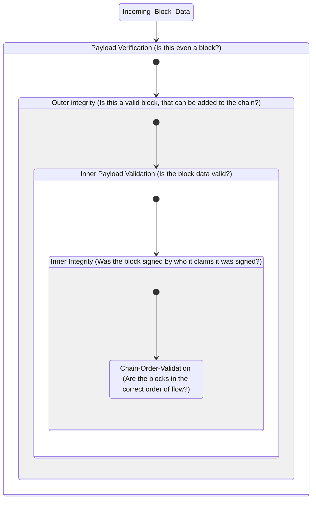

# Bill Validation

This graph describes our bill validation steps, from cheap, basic integrity checks on incoming data to
detailed coherency checks within the context of an active bill.

```mermaid
stateDiagram-v2
    state "Payload Verification (Is this even a block?)" as s1
    state "Outer integrity (Is this a valid block, that can be added to the chain?)" as s2
    state "Inner Payload Validation (Is the block data valid?)" as s3
    state "Inner Integrity (Was the block signed by who it claims it was signed?)" as s4
    state "Chain-Order-Validation (Are the blocks in the correct order of flow?)" as s5

    Incoming_Block_Data --> s1
    state s1 {
        [*] --> s2
        state s2 {
            [*] --> s3
            state s3 {
                [*] --> s4
                state s4 {
                    [*] --> s5
                    
                }
            }
        }
    }

```
